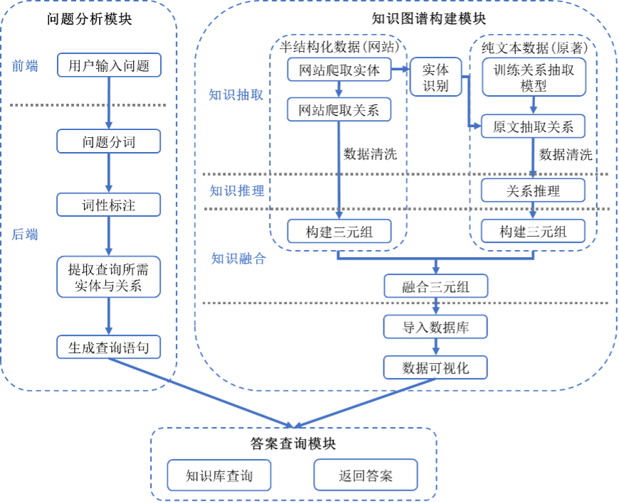
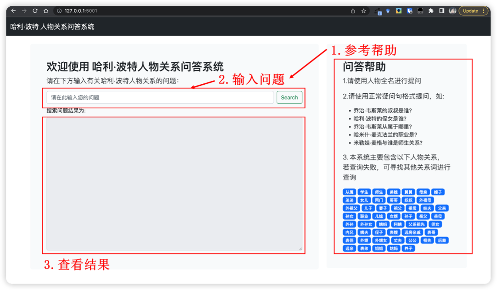

## 哈利·波特人物关系问答系统

### 系统介绍

本项目将构建小说《哈利·波特》中的各种实体及其关系的知识图谱与问答系统。首先基于一哈利·波特相关内容wiki网页，爬取其已有的各种实体关系，通过数据清洗后，构建初步的知识图谱三元组。防止网页文本信息不全，我们又使用预训练的实体识别模型从小说原文中抽取现有实体关系，对先前构造的三元组进行扩充，构建最终的知识图谱。接下来将内容存入Neo4j图数据库中，使用ltp语言分词、词性标注功能构建问答系统后端。最终使用Flask搭建简易python网页服务器，使用Bootstrap框架编写网页前端，最终搭建起哈利·波特人物关系问答系统。

### 系统架构



### 文件结构

- get_raw_data: 网站数据爬取及初步清洗
- relation_extraction: 训练关系抽取模型及关系推理
- relation_fusion.py: 知识融合
- neo_db: 三元组数据导入数据库
- kgqa及qa_app.py: 问答系统后端
- templates: 问答系统前端
- main.py: 程序入口

### 详细设计

详细设计内容请见项目word文档，其中对各部分代码及结构有详细描述

各代码文件包含详细注释，请查看代码文件

### 快速上手

首先确保已安装以下依赖：

- python3
- py2neo
- pyltp
- flask

**同时kgqa下下载分词模型包，下载地址http://model.scir.yunfutech.com/model/ltp_data_v3.4.0.zip**

项目文件中已包含提取完成的人物关系三元组文件，可直接使用，部署操作如下

1. 在[neo4j官网](https://neo4j.com/download/?ref=get-started-dropdown-cta)下载neo4j Desktop图数据库并安装

2. 创建任意名称图数据库，设置数据库密码为123456，或更改neo_db文件夹下config.py文件，将密码改为自己的配置

3. 执行neo_db下的creat_graph.py文件

   ```sh
   cd neo_de
   python3 creat_graph.py
   ```

   等待全部导入数据库后执行下一步操作

4. 返回至项目根目录，执行初始化flask应用操作

   ```sh
   cd ..
   export FLASK_APP=main
   flask run
   ```

   此时，若无报错，则通过浏览器进入http://127.0.0.1:5000，即可看到问答系统页面。

   若5000端口被占用，执行`flask run --port=5001`，可尝试其他空闲端口

5. 访问http://127.0.0.1:5000或自定义端口，即可进入主页面

